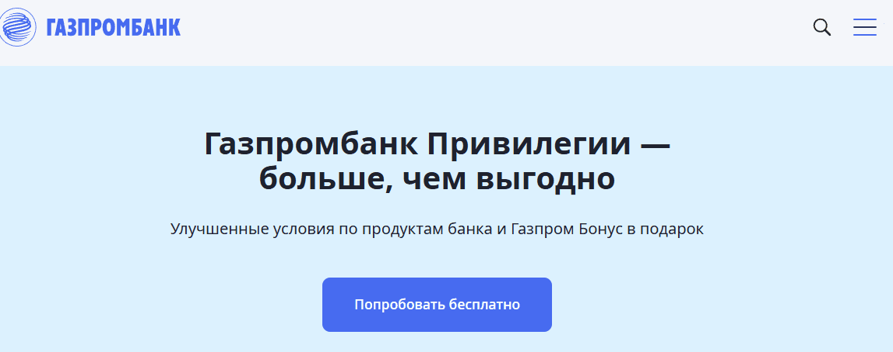
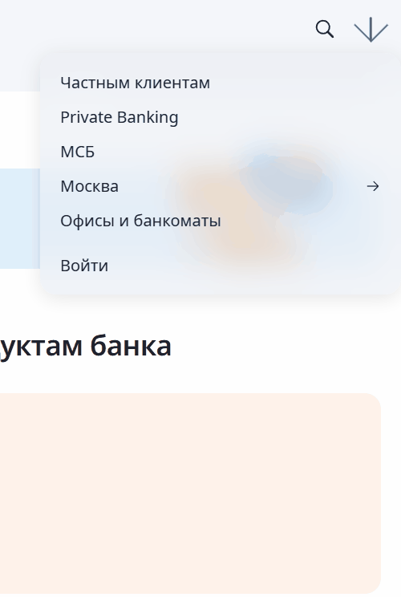
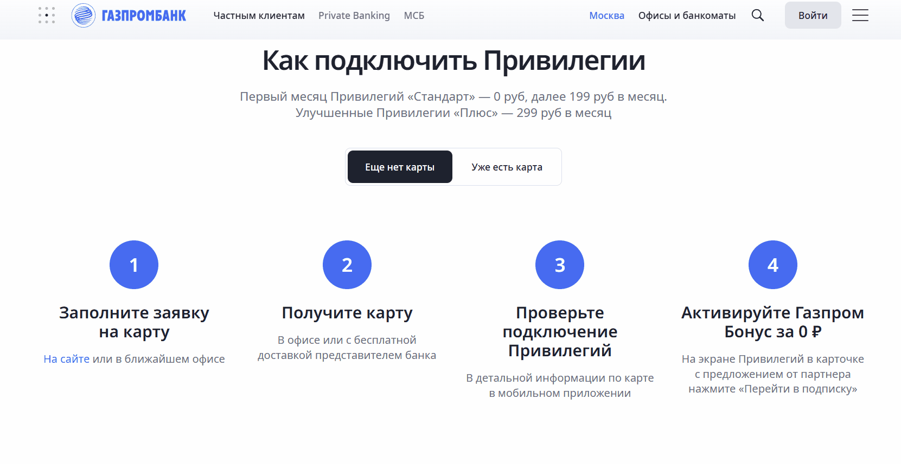
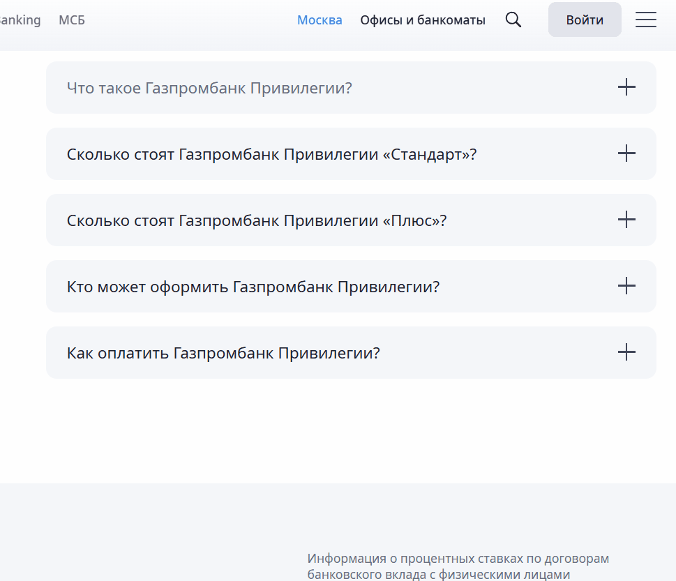
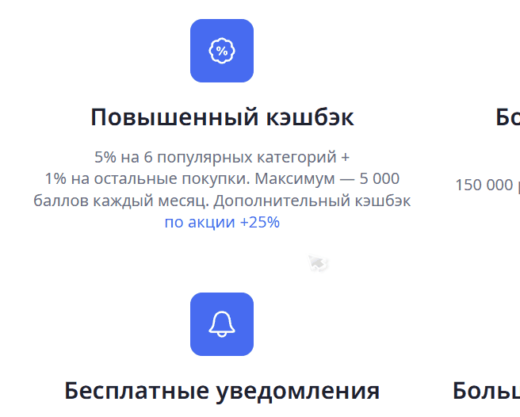

# Газпромбанк Привилегии — адаптивная вёрстка страницы

Одностраничный лендинг «Газпромбанк Привилегии», свёрстанный по макету Figma в рамках учебного проекта. Реализована резиновая адаптивная вёрстка от 360 до 4000 px по методологии mobile-first.

## Демо

- **Live-версия:** [_ссылка на GitHub Pages_](https://glorhatson.github.io/Vanilla-CSS-demo/)
- **Макет Figma:** [_ссылка на макет_](https://www.figma.com/design/OwE6DGnjGY4qWf3fNpDcRI/%D0%93%D0%B0%D0%B7%D0%BF%D1%80%D0%BE%D0%BC%D0%B1%D0%B0%D0%BD%D0%BA---%D0%90%D0%B4%D0%B0%D0%BF%D1%82%D0%B8%D0%B2-FWEB-6264?node-id=4-4545&p=f&t=y5WlOuAEAVHPcMCV-0)

## Стек

- **HTML5** — семантическая разметка, БЭМ-нейминг
- **SCSS (Sass)** — препроцессор, переменные, миксины, вложенность
- **Flexbox / CSS Grid** — построение сеток
- **Адаптивные изображения** — `<picture>`, `srcset`, `@2x` для Retina
- **SVG-спрайт** — иконки подключены одним файлом `images/sprite.svg`
- **Live Sass Compiler** — компиляция в `css/style.css` (см. настройки ниже)

## Запуск проекта

### Через Live Server (VS Code)

1. Клонировать репозиторий.
2. Открыть папку проекта в редакторе.
3. Правой кнопкой по `index.html` → **Open with Live Server**.

### Сборка SCSS

Проект рассчитан на плагин **Live Sass Compiler**. В настройках (`settings.json`) переопределён путь сохранения:

```json
{
  "liveSassCompile.settings.formats": [
    {
      "format": "expanded",
      "extensionName": ".css",
      "savePath": "~/../css/"
    }
  ]
}
```

Альтернативно можно собрать вручную через CLI:

```bash
sass scss/style.scss css/style.css
```

## Адаптивность

Вёрстка — mobile-first, стили наращиваются снизу вверх по контрольным точкам макета.

| Точка       | Миксин     | Назначение                          |
|-------------|------------|-------------------------------------|
| 360 px      | `vp-360`   | минимальный мобильный               |
| 768 px      | `vp-768`   | планшет                              |
| 1024 px     | `vp-1024`  | десктоп                              |
| 1304 px     | `vp-1304`  | широкий десктоп                      |
| до 4000 px  | —          | резиновая ширина через `max-width` у `.container` |

Максимальная ширина контента — `1304px`, центрируется утилитарным классом `.container` с боковыми отступами `15 / 20 / 40 px` в зависимости от брейкпоинта.

## Реализованные блоки

Все секции страницы `privileges.html` расположены внутри `<main>` и обёрнуты в `<section>`:

- **Header** — фиксированная шапка с бургер-меню, поиском и логином
- **Intro** — баннер с картинкой под разные плотности экрана через `<picture>`
- **Merits** — три карточки преимуществ
- **Advantages** — сетка преимуществ карты + баннер
- **Bonus** — две карточки с надбавками
- **Application** — форма заявки на карту
- **Subscriptions** — подписки Газпром Бонус
- **Connect** — табы «Еще нет карты» / «Уже есть карта» на CSS-радиокнопках
- **Benefit** — блок экономии
- **FAQ** — аккордеон со sticky-заголовком на десктопе
- **Footer** — подвал с контактами, картой сайта и соцсетями

## Базовые принципы

**БЭМ и семантика.** Разметка и стили именуются по методологии БЭМ (`block`, `block__element`, `block--modifier`). Селекторы без лишних цепочек и тегов — вес не «утяжеляется». Секции страницы — семантические теги (`<header>`, `<main>`, `<section>`, `<footer>`).

**Графика.** Иконки собраны в `images/sprite.svg` и подключаются через `<use xlink:href="images/sprite.svg#icon-name">`; цвет управляется `fill="currentColor"` от родителя. Растровые картинки нарезаны под мобильный / планшет / десктоп / широкий десктоп и подключены через `<picture>` + `srcset` с `@2x`-версиями для Retina. У позиционированной и декоративной графики отключена кликабельность (`pointer-events: none`).

**Формы.** Поля обёрнуты в `<form>`, у обязательных — `required`, у каждого — `name` и `id`. У радиокнопок задан `value`. Валидация стилизуется через `:invalid:not(:placeholder-shown)` и `:has()`. У кнопок проставлен обязательный `type`.

**Доступность.** У всех интерактивных элементов есть явная или скрытая подпись (`aria-label`, `<span class="visually-hidden">`). Там, где в макете нет заголовка, добавлен скрытый `<h2 class="visually-hidden">`. У декоративных картинок — `aria-hidden="true"`. Фокус с клавиатуры всегда даёт визуальный отклик.

**Подвал.** `body` — флекс-колонка с `min-height: 100vh`, `main` — `flex-grow: 1`, поэтому футер прижат к низу даже на коротких страницах.

## Дополнительно реализовано

Все паттерны ниже работают без JavaScript — на `:checked`, `:hover`, `:focus-visible` и `@keyframes`.

### Бургер-меню

Мобильное меню в шапке открывается по клику. 



### Выпадающий список городов

Внутри мобильного меню — второй раскрывающийся список.



### Табы «Еще нет карты» / «Уже есть карта»

Переключение между двумя списками на CSS-радиокнопках. Активный таб и активная панель подсвечиваются. Внутренний список «подъезжает» с задержкой — эффект каскадного появления.



### Аккордеон FAQ

Каждый вопрос + контент. Раскрытие анимируется. Плюсик при открытии поворачивает вертикальную линию и превращается в минус.



### Тултипы

Всплывающие подсказки в карточках блока «Advantages». Работает и с клавиатуры — не только мышью.



### Анимации

- картинка внутри карточки «bonus-card» пульсирует при наведении.
- по баннеру «Увеличьте доход» периодически пробегает блик.
- карточка подписок приподнимается и отбрасывает тень.

### Состояния UI-kit

Все интерактивные элементы реагируют на три состояния: `:hover` (подсветка), `:focus-visible` (рамка для клавиатуры), `:active` (тактильный отклик). Это кнопки, ссылки, поля формы, чекбоксы, соцсети, табы.

## Лицензия

Учебный проект. Исходный дизайн и материалы принадлежат Газпромбанку.